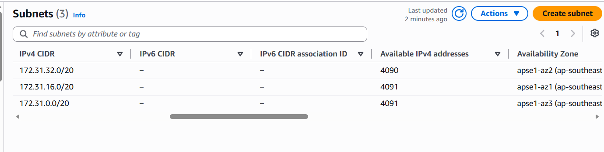
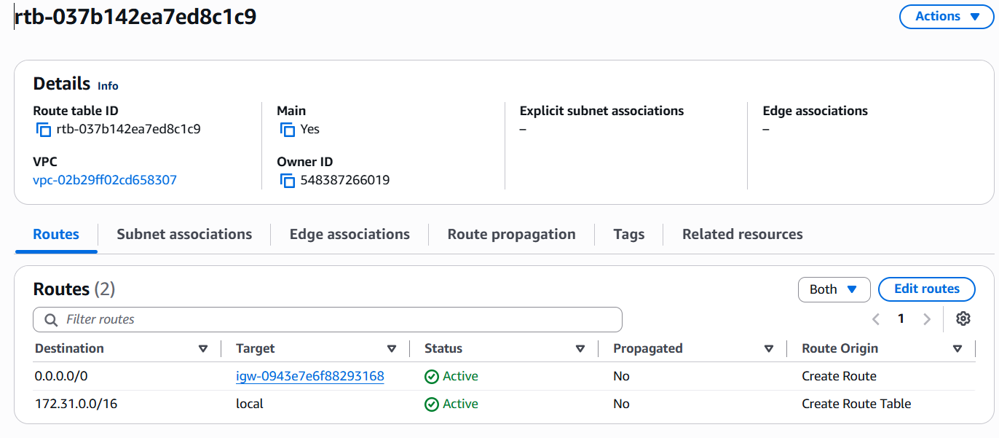
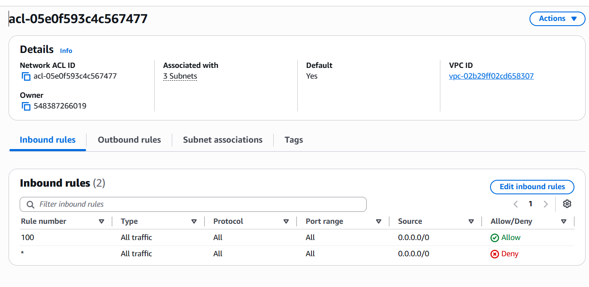
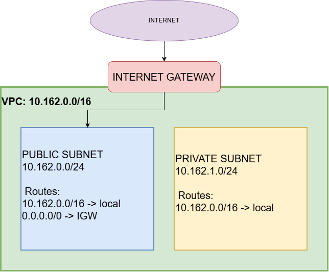

# Assignment 2 Submission

<!--
How to use this template:

1. Copy this file to submissions/assignment-2/<your-github-username>/submission.md
2. Replace every answer placeholder with your own answer. Delete the angle brackets too.
3. Save your four images in the same folder, with the exact file names below.
4. Do not write your full name or your student number in this file.
-->

## About me

- GitHub username: PalattaoMekylla
- Section: IV-CCSAD
- IAM user name that I signed in with: ccsad-g05
- X: 162

---

## Part A. Explore

### A1. The VPC

Default VPC IPv4 CIDR:

172.31.0.0/16
Number of addresses in that CIDR:

65,536

### A2. The subnets

| Availability Zone | IPv4 CIDR |
| --- | --- |
| ap-southeast-1c | 172.31.32.0/20 |
| ap-southeast-1b | 172.31.16.0/20 |
| ap-southeast-1a | 172.31.0.0/20 |

Screenshot 1. Save it as `screenshot-1-subnets.png` in your folder. The image line below shows it.

### A3. Available addresses

Available IPv4 addresses in each subnet:

4090, 4091, 4091

Why is the number lower than 4,096?

AWS reserves 5 addresses in every subnet (the first four and the last one). So an empty /20 subnet has 4,096 - 5 = 4,091 available addresses.

What uses the missing address in the subnet with the lowest number?

Network interfaces (ENIs) - e.g., instances, NAT gateways, load balancers - each hold one address in that subnet.

### A4. The route table

| Destination | Target |
| --- | --- |
| 0.0.0.0/0 | igw-0943e7e6f88293168 |
| 172.31.0.0/16 | local |

Screenshot 2. Save it as `screenshot-2-routes.png` in your folder. The image line below shows it.

### A5. Public or private

Are the default subnets public or private? Which route proves it?

Public. The route 0.0.0.0/0 sends traffic to the internet gateway

### A6. The internet gateway

State of the internet gateway:

Attached

What happens to the default subnets if the gateway is detached?

The route 0.0.0.0/0 loses its target. The subnets lose their path to the internet. Instances can still reach each other via the local route (172.31.0.0/16 → local).

### A7. NAT gateways

Number of NAT gateways:

0

Can a server in a new private subnet download updates? Why?

Not yet. A new private subnet uses a route table with only the local route. The server can download updates only after its route table gets the route 0.0.0.0/0 to a NAT gateway. If there are 0 NAT gateways, then no - you would need to create one (but you can't in this lab).

### A8. The network ACL

| Rule number | Source | Allow or Deny |
| --- | --- | --- |
| 100 | 0.0.0.0/0 | Allow |
| * | 0.0.0.0/0 | Deny |

How is a network ACL different from a security group?

Network ACL: attaches to a subnet, has allow and deny rules, is stateless, each direction needs its own rule, and rules are checked in order by number. Security group: attaches to a resource, has allow rules only, and is stateful,

Screenshot 3. Save it as `screenshot-3-network-acl.png` in your folder. The image line below shows it.

### A9. The default security group

Inbound rule (type and source):

Type: HTTP | Source: 0.0.0.0/0

Which resources can send traffic to an instance that uses it?

Only resources that also use the default security group. No other inbound rule exists, so the security group blocks traffic from every other source.

---

## Part B. Prepare

### B1. Plan two subnets

- Public subnet CIDR: 10.162.0.0/24
- Private subnet CIDR: 10.162.1.0/24

### B2. Route tables

Route table of the public subnet:

| Destination | Target |
| --- | --- |
| 10.162.0.0/16 | local |
| 0.0.0.0/0 | internet gateway |

Route table of the private subnet:

| Destination | Target |
| --- | --- |
| 10.162.0.0/16 | local |

### B3. My VPC diagram

Tool used (Excalidraw, draw.io, Lucidchart, or paper):

draw.io

Save your diagram as `vpc-diagram.png` in your folder. The image line below shows it.

### B4. Predict a change

Can you still open the web page from your laptop? Why?

No. My laptop is on the internet, so the instance needs the 0.0.0.0/0 route to send traffic back to me. Without it, there is no path out to the internet.

Can the instance still reach another instance in the VPC? Why?

Yes. The local route (10.162.0.0/16) is still in the route table, so internal traffic between subnets in the same VPC still works.

### B5. Place a database

Which subnet gets the database? Why?

I would put the database in the Private Subnet (10.162.1.0/24). Because its route table has no route to the internet gateway, nobody from the outside internet can reach the database, making it much more secure.

### B6. My question about VPCs

What is your question, and what made you think of it?

Can two different VPCs in the same AWS account talk to each other, and what happens if they accidentally use the exact same CIDR block like 10.162.0.0/16?

I thought of it because many AWS accounts use the exact same default range (172.31.0.0/16), so I wondered how AWS handles two VPCs trying to communicate when their IP addresses overlap.
